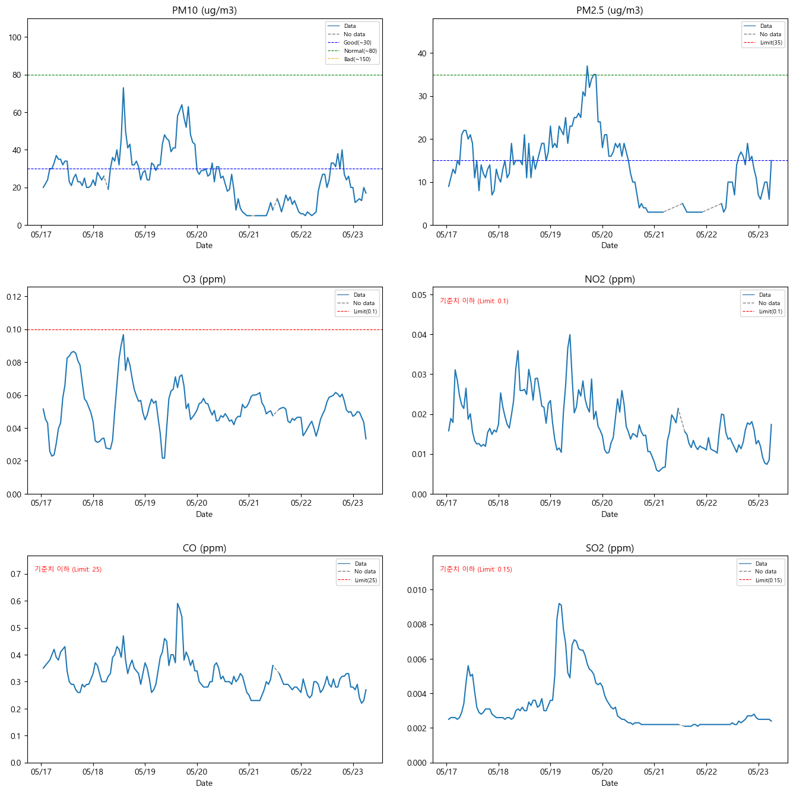
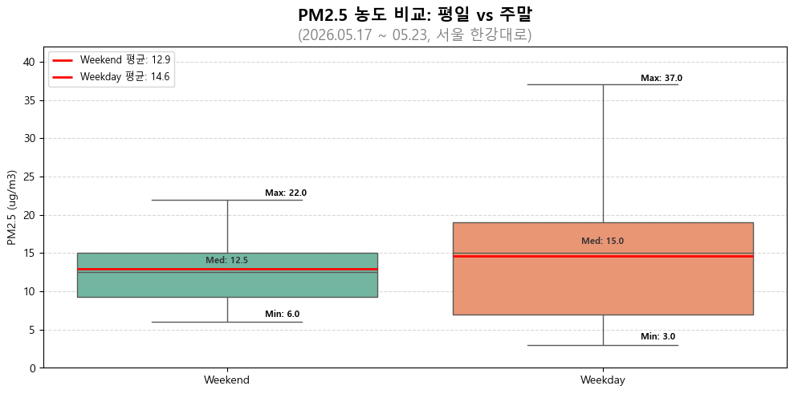
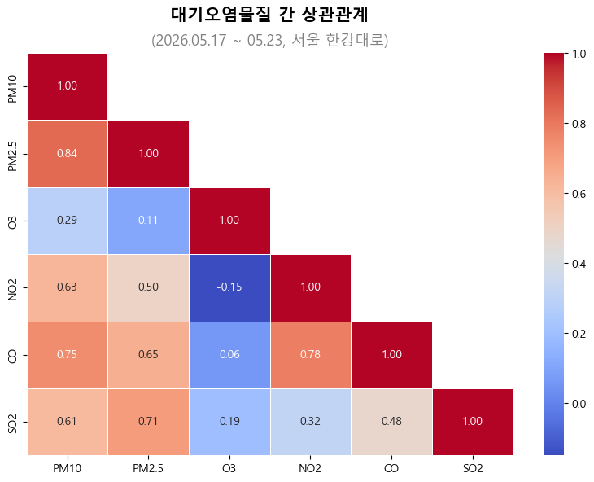
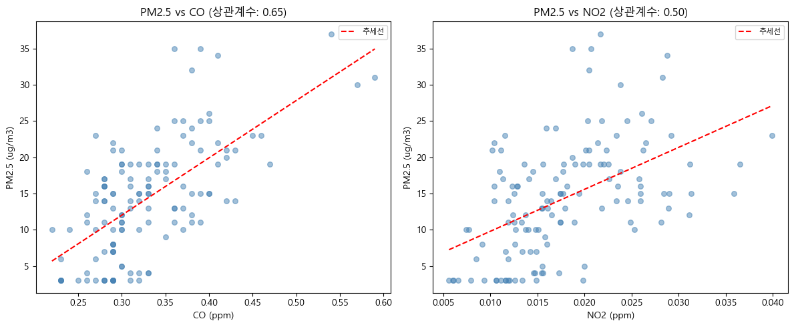
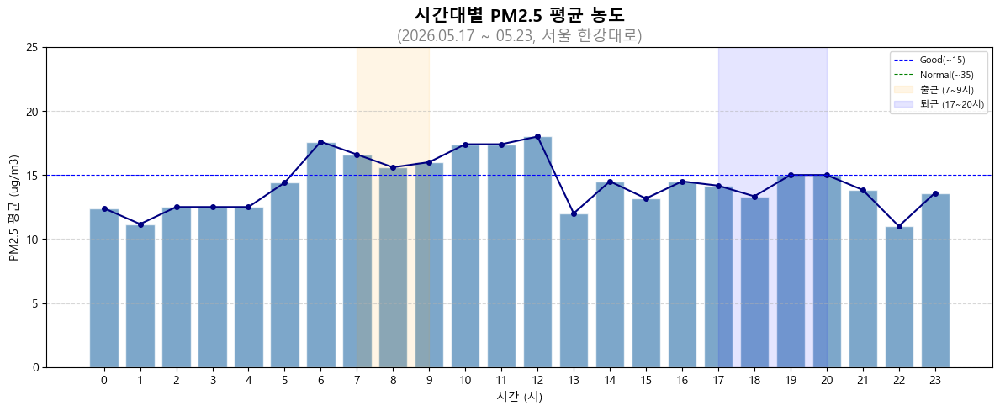
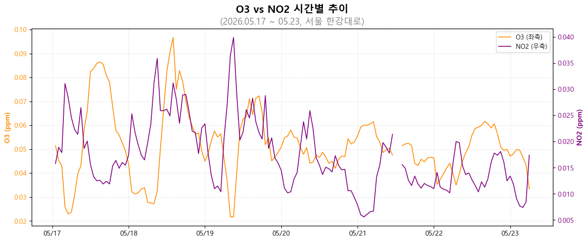

# 서울 대기오염 데이터 분석 (EDA)

[](https://nbviewer.org/github/Jenny5789/dev-logs/blob/main/air-analysis/air_analysis.ipynb)
[](https://colab.research.google.com/github/Jenny5789/dev-logs/blob/main/air-analysis/air_analysis.ipynb)

서울 한강대로 측정소의 대기환경기준물질 6가지를 탐색적 데이터 분석(EDA)한 프로젝트입니다.  
**기간:** 2026.05.17 ~ 05.23 | **데이터 출처:** 에어코리아 | **도구:** Python (pandas, matplotlib, seaborn)

---

## 📌 개요

대기환경보전법 기반 6가지 기준물질을 서울역 앞 한강대로에서 수집한 데이터로 분석했습니다.

| 항목 | 내용 |
|:----:|:-----|
| 분석 유형 | 탐색적 데이터 분석 (EDA) |
| 측정소 | 서울 용산구 한강대로 (서울역 앞) |
| 데이터 출처 | 에어코리아 (www.airkorea.or.kr) |
| 분석 기간 | 2026.05.17 ~ 05.23 (6일) |
| 분석 항목 | PM10, PM2.5, O3, NO2, CO, SO2 |
| 분석 도구 | Python (pandas, matplotlib, seaborn) |

---

## 📊 분석 내용

### 1. 대기오염 물질 시간별 추이
6가지 물질의 1시간 단위 측정값 변화를 시계열 그래프로 시각화했습니다.
기준선을 함께 표시해 전반적인 오염 수준을 파악했습니다.



- 분석 기간 전반적으로 모든 항목이 기준치 이하로 유지됨
- PM10, PM2.5, NO2, CO, SO2가 05/19 전후로 동시에 상승하는 경향이 관찰됨
- SO2는 05/19 구간에서 일시적으로 급등한 후 급격히 감소

### 2. 평일 vs 주말 PM2.5 분석
서울역 앞 한강대로는 평일과 주말의 활동 패턴이 다른 도심 도로입니다.
박스플롯으로 요일에 따른 PM2.5 농도 차이를 비교했습니다.



- 평일 평균 14.6 ug/m3, 주말 평균 12.9 ug/m3으로 평일이 1.7 ug/m3 높게 나타남

### 3. 대기오염 물질 간 상관관계 분석
히트맵과 산점도로 PM2.5와 다른 오염물질 간의 상관관계를 확인했습니다.




- PM10 ↔ PM2.5 (r=0.84), PM2.5 ↔ SO2 (r=0.71), PM2.5 ↔ CO (r=0.65) 강한 양의 상관관계
- PM2.5 ↔ NO2 (r=0.50) 중간 수준의 양의 상관관계
- O3 ↔ NO2 (r=-0.15) 뚜렷한 연관성 없음

### 4. 시간대별 PM2.5 패턴 분석
6일치 데이터를 시간대(0~23시)별로 평균 내어 하루 중 PM2.5 농도 변화 경향을 파악했습니다.



- 가장 높은 시간대: 12시 (18.0 ug/m3), 가장 낮은 시간대: 22시 (11.0 ug/m3)
- 출근 시간대(7~9시)에 소폭 상승하는 경향이 관찰됨

### 5. O3 vs NO2 분석
이중 Y축 그래프로 O3와 NO2의 시간별 변화를 시각화하여 두 물질의 관계를 탐색했습니다.



- 상관계수 -0.15로 약한 음의 상관관계
- 일부 구간에서 O3 상승 시 NO2 하강하는 경향이 관찰됨

---

## 🔍 주요 발견

- 분석 기간 PM2.5 평균 14.2 ug/m3로 전반적으로 **좋음** 수준 유지
- 평일 PM2.5(14.6 ug/m3)가 주말(12.9 ug/m3)보다 1.7 ug/m3 높게 나타남
- PM2.5는 CO(r=0.65), NO2(r=0.50)와 각각 양의 상관관계가 관찰됨
- O3와 NO2는 약한 음의 상관관계(r=-0.15)로 뚜렷한 연관성은 관찰되지 않음
- 12시에 PM2.5 가장 높고(18.0 ug/m3), 22시에 가장 낮아(11.0 ug/m3) 낮 시간대에 상대적으로 높은 경향이 관찰됨

> 분석 기간 동안 서울 한강대로의 대기질은 전반적으로 양호한 수준을 유지했습니다.
> PM2.5는 CO, NO2 등 교통·연소 관련 물질과 함께 움직이는 경향이 있으며, 평일과 낮 시간대에 상대적으로 높게 나타났습니다.
> 단기 데이터의 한계가 있으나, 도심 대기오염의 일반적인 패턴을 확인할 수 있었습니다.
>
> 평일과 주말의 PM2.5 차이는 예상보다 작았습니다. 서울역 특성상 평일 출퇴근객과 주말 방문객 모두 대중교통을 주로 이용하는 장소여서, 차량 배출가스의 영향이 상대적으로 제한적이었던 것으로 추정됩니다.
> 분석 후반부로 갈수록 일부 물질의 농도가 감소하는 경향이 관찰되었는데, 강수에 의한 대기 중 오염물질 세정 효과와의 연관성이 있는지 추가 분석이 필요합니다.

---

## ⚠️ 한계점

- 6일치 단기 데이터로 통계적 유의성 낮음
- 기상 데이터 및 교통량 데이터 부재로 원인 직접 검증 불가

---

## 📁 파일 구조

```
├── air_analysis.ipynb        # 분석 코드
├── last_amb_hour_time.xls    # 원본 분석 데이터
├── images/                   # 그래프 이미지
└── README.md
```

---

## 🛠 사용 기술


