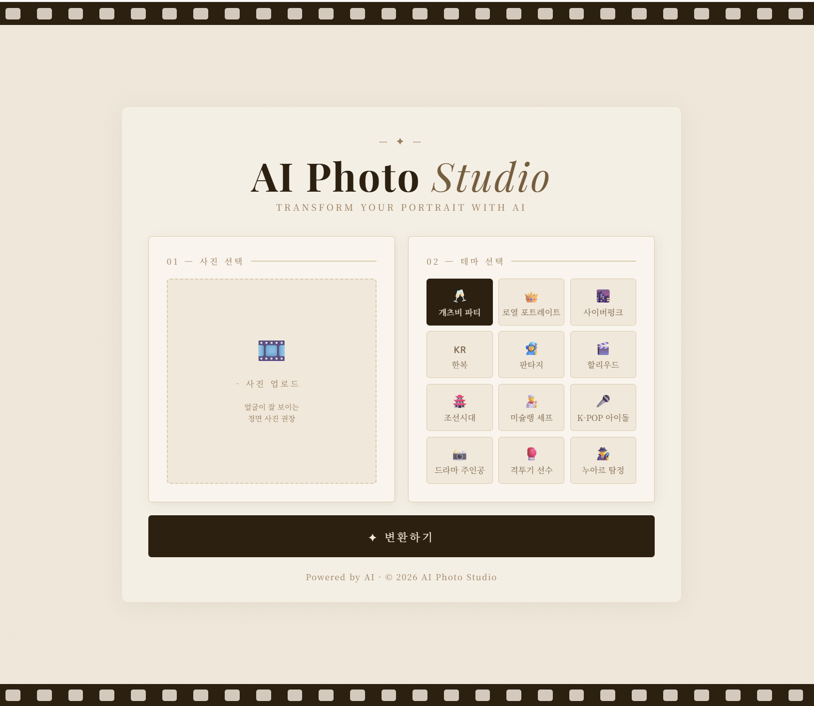

# 🎞️ AI Photo Studio

> AI를 활용해 얼굴 사진을 다양한 테마로 변환하는 웹 서비스

## 📸 스크린샷


## 🔗 배포 링크
https://photo-ai-mkzy.onrender.com

## 📌 프로젝트 소개
AI 전시회에서 얼굴 합성 기술을 체험한 후, 직접 구현해보고 싶어 시작한 프로젝트.
사진을 업로드하면 AI가 선택한 테마에 맞게 얼굴을 합성해 새로운 이미지를 생성합니다.

## 🛠️ 사용 기술
| 분류 | 기술 |
|------|------|
| Backend | Python, Flask |
| Frontend | HTML, CSS, JavaScript |
| AI API | Replicate (PhotoMaker) |
| 배포 | Render |
| 버전 관리 | GitHub |

## ✨ 주요 기능
- 얼굴 사진 업로드 및 미리보기
- 12가지 테마 선택 (개츠비, 한복, 사이버펑크, K-POP 아이돌 등)
- AI 얼굴 합성 및 결과 이미지 출력
- 모바일 반응형 UI

## 📁 프로젝트 구조
```
photo-ai/
├── app.py              # Flask 서버 & API 연동
├── templates/
│   └── index.html      # 프론트엔드 UI
├── uploads/            # 업로드된 사진 저장
├── requirements.txt    # 패키지 목록
└── .env                # API 키 (비공개)
```
## 🚀 로컬 실행 방법
```bash
# 가상환경 활성화
venv\Scripts\activate

# 서버 실행
python app.py
```

## 📝 배운 점
- Flask를 활용한 웹 서버 구축
- REST API 연동 (Replicate)
- 프론트엔드 기초 (HTML/CSS/JS)
- GitHub & Render를 통한 배포 경험

## 🤖 개발 과정
본 프로젝트는 Claude (Anthropic)의 도움을 받아 개발했습니다.
AI 도구를 활용한 개발 경험 자체를 학습 목표로 삼았으며,
코드의 동작 원리를 이해하는 것에 초점을 맞췄습니다.
