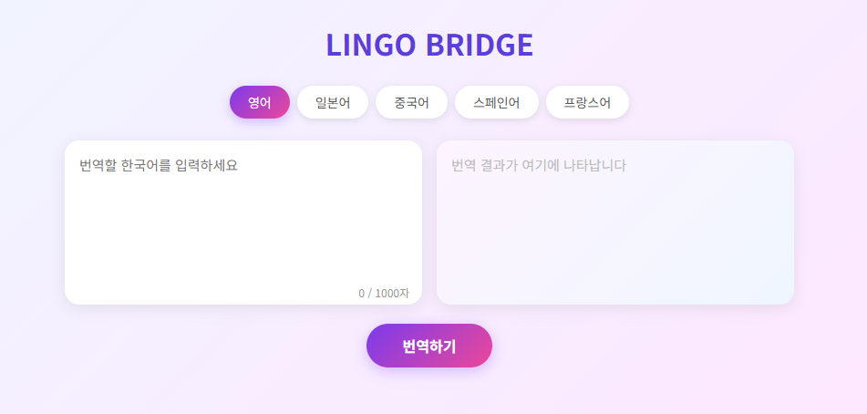

# 🌐 LINGO BRIDGE

한국어를 다양한 언어로 번역해주는 웹 번역기입니다.

---

## 📸 스크린샷



---

## 📌 프로젝트 소개

LINGO BRIDGE는 한국어 텍스트를 영어, 일본어, 중국어, 스페인어, 프랑스어로 번역할 수 있는 웹 서비스입니다.<br>
별도의 설치 없이 브라우저에서 바로 사용할 수 있으며, 모바일 환경에서도 이용 가능합니다.

---

## ✨ 주요 기능

- 5개 언어 번역 지원 (영어, 일본어, 중국어, 스페인어, 프랑스어)
- 언어 변경 시 번역
- 입력창 초기화 버튼
- 글자수 표시 및 1000자 제한
- 모바일 반응형 디자인

---

## 🚀 사용법

1. `index.html` 파일을 브라우저로 열기
2. 번역할 언어 버튼 클릭
3. 한국어 텍스트 입력
4. **번역하기** 버튼 클릭

---

## 🛠 기술 스택

| 항목 | 내용 |
|------|------|
| 언어 | HTML, CSS, JavaScript |
| CLI 버전 | Python (deep-translator) |
| 번역 API | MyMemory Translation API |
| 폰트 | Noto Sans KR (Google Fonts) |

---

## 📁 파일 구조

```
translator/
├── index.html
├── translator.py  
├── screenshot.png   
└── README.md
```
